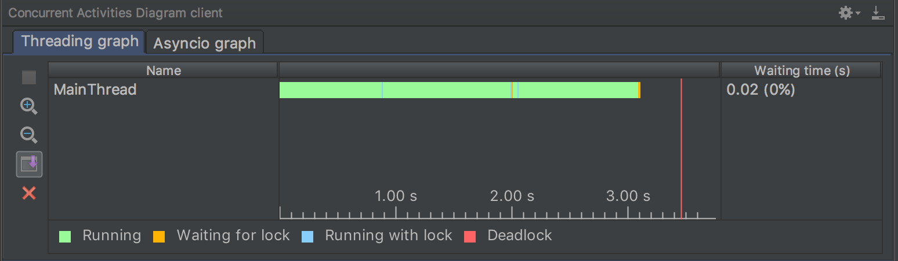
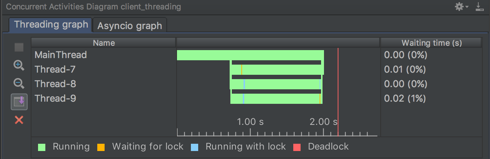

# 非同期プログラミング

- Author: [Masashi Shibata (@c_bata_)](https://twitter.com/c_bata_)
- Date: 2017/03/21 (Tue)
- Event: 神戸Pythonの会

## アジェンダ

1. 同期的なアプローチ
2. マルチスレッド
3. async/awaitによる非同期処理
4. マルチプロセス
5. 手を動かしてみよう


## 同期的なアプローチ

まずはテーマである非同期処理の話をする前に、とあるサーバに複数のHTTPリクエストを送る例を見てみましょう。

### サーバーのセットアップ

今からとあるサーバにいくつかHTTPのリクエストを送ってみます。
実際にどこかのサービスのAPIとかを叩いてみてもいいんですが、
あまり負荷をかけるのも迷惑なのでサーバを用意しますね。

```python
import time

def app(environ, start_response):
    time.sleep(1)
    start_response('200 OK', [('Content-type', 'text/plain; charset=utf-8')])
    return [b'This is a slow web api']
```

ワーカー数を3つで動かしてみましょう。

```console
$ gunicorn -w 3 server:app
```

### クライアントを書いてみる

それではいくつかHTTPリクエストを送ってみます。
Pythonでは、requestsという有名なパッケージがあるので、こちらを使ってみましょう。

```python
import requests

def main():
    urls = ['http://localhost:8000' for _ in range(3)]
    for u in urls:
        r = requests.get(u)
        print(r.text)

if __name__ == '__main__':
    main()
```

実行してみます。

```console
$ time python client_sync.py 
This is a slow web api
This is a slow web api
This is a slow web api

real    0m3.240s
user    0m0.164s
sys     0m0.037s
```

3秒ちょっとかかりました。
今回用意したサーバは、レスポンスを返すのに1秒かかるので、ごく自然な結果ですね。
それでは時間を短縮する方法を考えてみましょう。

## マルチスレッド

サーバからのレスポンスを待っている間、先程のPythonのプログラムはCPUを使っていません。
これは少し無駄なように思えますね。
複数のスレッドを使うことで、次のように効率化できそうです。


それではマルチスレッドを用いて、高速化してみましょう。
いくつかの危険性をもつ実装ですが、素直に書くとこのように書いてしまうかもしれません。

```python
import requests
from threading import Thread
from queue import Queue

def fetch(url, results_queue):
    resp = requests.get(url)
    results_queue.put(resp.text)

def main():
    results_queue = Queue()

    threads = []
    urls = ['http://localhost:8000' for _ in range(3)]
    for u in urls:
        thread = Thread(target=fetch, args=[u, results_queue])
        thread.start()
        threads.append(thread)

    while threads:
        threads.pop().join()

    while not results_queue.empty():
        print(results_queue.get())

if __name__ == '__main__':
    main()
```

危険な点がいくつかありそうですが、マルチスレッドを使って並行にリクエストを送信するようにしてみました。
GILの制約があるため、Pythonにおけるマルチスレッドを行っても1つのプロセッサコアしか利用できませんが、I/O待ちなどの処理ではGILが解放されるため、その間に別のスレッドがプロセッサコアを使うことができます。


```console
$ time python client_threading.py 
This is a slow web api
This is a slow web api
This is a slow web api

real    0m1.199s
user    0m0.167s
sys     0m0.028s
```

処理時間は1/3程度になり、非常に高速になりました。
念のため、スレッドの動きを見てみましょう。


**マルチスレッド化する前**



**マルチスレッド化した後**



目標どおりの動きをしていそうです。
thrreadingモジュールを使って、高速に処理することができました。

しかし、この実装は危険であるとお伝えしました。
どうしてでしょうか？

- URLの数を増やすとどうなるでしょうか？
- タイムアウトしてしまった場合は、どうなるでしょうか？
- 使用制限のあるAPIへのリクエストはどのようにすればいいでしょうか？

マルチスレッドのプログラムでこれらのことをコントロールするのは非常に難しいです。


### 非同期版クライアント

次は今回のテーマである非同期プログラミングを体験してみましょう。

```python
import aiohttp
import asyncio

async def fetch(l, url):
    async with aiohttp.ClientSession(loop=l) as session:
        async with session.get(url) as response:
            return await response.text()


async def main(l, url, num):
    tasks = [asyncio.ensure_future(fetch(l, url)) for _ in range(num)]
    return await asyncio.gather(*tasks)


if __name__ == '__main__':
    loop = asyncio.get_event_loop()
    results = loop.run_until_complete(main(loop, 'http://localhost:8000', 3))
    for r in results:
        print(r)
```

解説は後回しにして、とりあえず実行してみましょう。

```console
$ time python client_async.py 
This is a slow web api
This is a slow web api
This is a slow web api

real    0m1.415s
user    0m0.333s
sys     0m0.051s
```

**1.415s** で済みました。
multithreadingモジュールを使った例よりも遅いですが、3秒かかっていたことを考えると大幅に速くなっています。
multithreadingモジュールなどは使っていませんが、何故短くなったのでしょうか？
スレッドの動きを確認してみます。

**非同期版**


multithreadのときと同じようなグラフになりました。


## 多くのリクエストを送ってみる

9回ほどリクエストを送ってみます。
サーバのworker数は3つなので、9個中6個のリクエストは前の処理が完了するのを待ちます。
1, 2秒待つプロセスがあるでしょう。

```python
import aiohttp
import asyncio

async def fetch(l, url):
    async with aiohttp.ClientSession(loop=l) as session:
        async with session.get(url) as response:
            return await response.text()

async def bound_fetch(semaphore, l, url):
    async with semaphore:
        return await fetch(l, url)

async def main(l, url, num):
    s = asyncio.Semaphore(3)
    tasks = [asyncio.ensure_future(bound_fetch(s, l, url))
             for _ in range(num)]
    return await asyncio.gather(*tasks)

if __name__ == '__main__':
    loop = asyncio.get_event_loop()
    results = loop.run_until_complete(main(loop, 'http://localhost:8000', 9))
    for r in results:
        print(r)
```


```console
$ time python client_async_with_semaphore.py 
This is a slow web api
This is a slow web api
 : (中略)

real    0m3.375s
user    0m0.318s
sys     0m0.050s
```


## マルチプロセス

並行処理のアプローチは、マルチスレッドだけではありません。
GILの制約を持ったPythonにおけるマルチスレッドは、1つのCPUコアを効率的に使いますが、

今回のプログラムは、I/OバウンドでCPUはそれほど使っていないでしょう。
おそらくGILにより遅くなっている点は少ないと思います。


```
import requests
from multiprocessing import Pool


def fetch(url):
    resp = requests.get(url)
    return resp.text


def main():
    urls = ['http://localhost:8000' for _ in range(3)]
    with Pool(processes=3) as pool:
        results = pool.map(fetch, urls)

    for r in results:
        print(r)

if __name__ == '__main__':
    main()

```

``multiprocessing`` モジュール提供する ``Pool`` クラスは、複数のプロセスワーカーを管理する際に面倒なことを全て負担してくれています。コードは非常にシンプルで保守も簡単です。

```console
$ time python client_multiprocessing.py 
This is a slow web api
This is a slow web api
This is a slow web api

real    0m1.347s
user    0m0.234s
sys     0m0.079s
```

今回のプログラムはほとんどがI/Oで、GILによる制約はあまりありません。
子プロセスの生成には、メモリ空間のコピーなどでスレッドの生成に比べオーバーヘッドがかかります。
そのため実行時間は、マルチスレッドを用いたプログラムよりも長くなってしまいました。

たくさん、プロセスを生成すると、メモリもたくさん消費するでしょう。
もし並行処理が必要になった場合には、これらのメリットやデメリットを踏まえて適切なアプローチをとってください。


## 手を動かしてみよう

実際に動かしてみましょう。何かわからないことがあれば質問ください。
余力のある方は、multithreadingやmultiprocessingモジュールを使って書いてみるといいと思います
